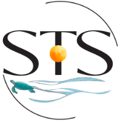

# Science-and-Technology-Society-Use-of-NASA-STELLA-Q2-Spectrometer

The NASA STELLA-Q2 can make 18 different measurements from violet/blue portions of the electromagnetic spectrum out to near infrared regions (beyond our range of vision). STELLA instruments are portable low-cost do-it-yourself (DIY) instruments that support science education.

This repository focuses on the 

https://landsat.gsfc.nasa.gov/stella/

