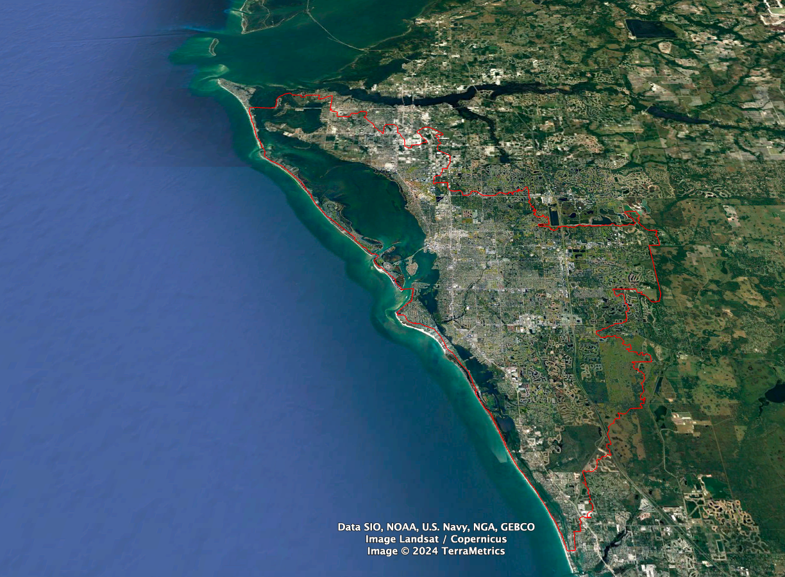

# Science-and-Technology-Society-Use-of-NASA-STELLA-Q2-Spectrometer

The **Science and Technology Society (STS) of Sarasota-Manatee Counties, Florida** is working with the NASA STELLA (Science and Technology Education for Land/Life Assessment) outreach program as a part of our STEM initiative. According to their site, "NASA STELLA instruments are portable low-cost do-it-yourself (DIY) instruments that support science education, and outreach through scientific engagement, inquiry, and discovery while helping you understand Landsat better".

The NASA STELLA-Q2 is capable of making 18 different spectral measurements from the violet/blue portions of the electromagnetic spectrum out to near infrared regions (beyond our range of vision). More can be found on the STELLA DIY instruments at the following link.

>https://landsat.gsfc.nasa.gov/stella/

The following is a sample-by-sample animation of the type of data acquired from STELLA-Q2 Spectrometer built by STS. STS is providing the python code in a Jupyter Notebook that can be used as an example of how to display the data from the STELLA-Q2 device. We have also provided some sample data to be used with this notebook. It should be noted that we did change the name of some of the headers created from our instrument to add colors to each of the wavelength reading that are made in order to display each wavelength as a corresponding color. The near infrared wavelength readings are colored in grays, wheat and gold where the normal visible spectrum colors are in vivid colors that they represent. 

>
>
>
---
## Building the STELLA-Q2 device:
The NASA site offers detailed instructions on how to build the STELLA-Q2 instrument at the following link:

>https://landsat.gsfc.nasa.gov/stella/stella-q2/stella-q2-build-instructions/

>

This is the STELLA parts list that we used to order our components:

>

This is the STS STELLA-Q2 instrument that we built using the details supplied by the NASA:

>
---
## Programming the STELLA-Q2:
There is excellent documentation on programming this device that can be found at the following link:

>https://landsat.gsfc.nasa.gov/stella/stella-q2/stella-q2-programming-instructions/
---
## Applications: 
We are just starting on the applications from this spectrometer, but they appear to be immense. The following firgure provides some information on just one application we are delving into as noted from North Carolina Geographic Information Coordinating Council by the Statewide Mapping Advisory Committee, Working Group for Orthophotography Planning, July 2011.

>

Bianca Clento of Rochester Institute of Technology has an excellent poster on the **Quantifying Plant Biodiversity Using Different Spectrometers, Spectral Unmixing, and UAV Imagery** that serves as an example of the type of application that we would like to apply for SW Florida Gulf Coast region related to the vegetative health along our coastline. 

>

Our long-term plan is to deploy the STELLA-Q2 on a drone captureing spectral data along our Florida Gulf Coast. In recent meeting with Sherri Swanson,Ecological and Marine Resources Division Manager for Manatee County Natural Resources, Sherri has been extremely helpful providing us shapefiles for the SBEP Watershed boundaries and a very interesting paper on *Identifying and Diagnosing Locations of Ongoing and Future Saltwater Wetland Loss: Mangrove Heart Attack* available in this repository too.  

>

and is image is from the SBEP Watershed Boundaries Shapefile:

>

## Testing:
Now that we have out STELLA-Q2 device in working order, we will start our testing from know color swatches to actual vegatative species and states of health.
