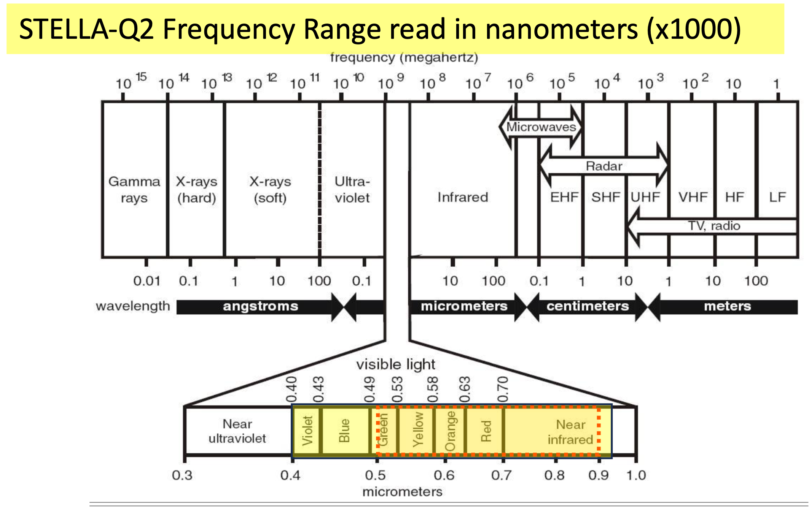

# Science-and-Technology-Society-Use-of-NASA-STELLA-Q2-Spectrometer

The **Science and Technology Society (STS) of Sarasota-Manatee Counties, Florida** is working with the NASA STELLA (Science and Technology Education for Land/Life Assessment) outreach program as a part of our STEM initiative. According to their site, 

- "NASA STELLA instruments are portable low-cost do-it-yourself (DIY) instruments that support science education, and outreach through scientific engagement, inquiry, and discovery while helping you understand Landsat better". 

**STELLA instruments are developed under the influence and inspiration of Landsat.** This alignment not only fulfills our project needs but also serves as a compelling addition to our STEAM initiatives:

1) To train the minds young Floridians to be more aware of our wetlands, to care for them and about them.  Our program will bring more community publicity to the issue of wetlands change, as well.

2) To expose our middle- and high- school aged students to real science, using real data.  That means how to use instrumentation and understand how the data is collected, and how the data can be used in the real world.  It means not only to create beautiful charts and images that form the good results, but also to understand that data must be collected in a proper and reproducible way, that there physics reasons for lack of accuracy and lack of precision that one must understand and minimize in order to achieve meaningful results.

The NASA STELLA-Q2 is capable of making 18 different spectral measurements from the violet/blue portions of the electromagnetic spectrum out to near infrared regions (beyond our range of vision).The following figure **(1)** shows the visible spectrum by wavelength, and the yellow box indicates the STELLA-Q2 frequency range. 

>

More can be found on the STELLA DIY instruments at the following link.

>https://landsat.gsfc.nasa.gov/stella/

The following is a sample-by-sample animation of the type of data acquired from STELLA-Q2 Spectrometer built by STS. STS is providing the python code in a Jupyter Notebook that can be used as an example of how to display the data from the STELLA-Q2 device. We have also provided some sample data to be used with this notebook. It should be noted that we did change the name of some of the headers created from our instrument to add colors to each of the wavelength reading that are made in order to display each wavelength as a corresponding color. The near infrared wavelength readings are colored in grays, wheat and gold where the normal visible spectrum colors are in vivid colors that they represent. 

>
>
>
---
## Building the STELLA-Q2 device:
The NASA site offers detailed instructions on how to build the STELLA-Q2 instrument at the following link:

>https://landsat.gsfc.nasa.gov/stella/stella-q2/stella-q2-build-instructions/

>

The following image is the provided  STELLA parts list that we used to order our components. If you download the parts list file from this repository, then the links will direct you to each component from one of the two vendors. 

>

This is the STS STELLA-Q2 instrument that STS has built using the details supplied by the NASA:

>
---
## Programming the STELLA-Q2:
There is excellent documentation on programming this device that can be found at the following link:

>https://landsat.gsfc.nasa.gov/stella/stella-q2/stella-q2-programming-instructions/
---
## Applications: 
We are just starting on the applications from this spectrometer, but they appear to be immense. The following figure provides some information on just one application we are delving into **(1)** 

>

---
Bianca Clento of Rochester Institute of Technology has an excellent poster on the *Quantifying Plant Biodiversity Using Different Spectrometers, Spectral Unmixing, and UAV Imagery* that serves as an example of the type of application that we would like to apply for SW Florida Gulf Coast region related to the vegetative health along our coastline. 

>

---
Our long-term plan is to deploy the STELLA-Q2 on a drone capturing spectral data along our Florida Gulf Coast. In a recent meeting with Sherri Swanson, Ecological and Marine Resources Division Manager for Manatee County Natural Resources, Sherri has been extremely helpful providing us shapefiles for the Sarasota Bay Estuary Program (SBEP) Watershed boundaries and a very interesting paper on Identifying and Diagnosing Locations of Ongoing and Future Saltwater Wetland Loss **(2)** available in this repository too.  

>

and is image is from the SBEP Watershed Boundaries Shapefile:

>

In this report they state:

      "Landsat green and near-infrared bands can be used to identify mangroves of varying conditions. Landsat imagery of two different periods can be used to measure mangrove forest improvement or decline. 
      This use also provides a sensitive expression of mangrove health in areas that are difficult to access on site and which are only revealed via aerial photography at very large scale (for example under 1000 scale). 
      A map of mangrove status and change was used to provide a detailed review the study area and identify 90 restoration opportunities, 121 sites of natural decline, 13 sites where there is no remedy for the decline and 3 sites where restoration is in progress but the mangroves have to yet rebounded to their earlier vigor."

STS plans on providing the ground truth data to be used in the calibration of these Landsat images. 

As stated in their paper:

      "Mangrove Conditions can be assessed from the work performed by Pastor-Guzman et al (2015) compared 20 hyperspectral and broad band vegetation indices to relative mangrove canopy chlorophyll measured at 12 sites along the northwest coast of the Yucatan Peninsula, Mexico. The sites were 30m by 30m to represent Landsat spatial resolution. The purpose of the work was to develop indicators of mangrove condition using remotely sensed data. Of the indices, normally distributed vegetation index green (NDVIgreen) was the most sensitive to canopy chlorophyll at the site level (r2 = 0.805.) The formula for NDVIgreen uses the near infrared and green bands. We found the NVDIgreen index to be an excellent indicator of mangrove condition in the Charlotte Harbor area.
      
      The formula for NDVIgreen using Landsat 8 bands is:

          *NDVIgreen = (NIR−Green)/(NIR+Green)*
    
    Where:
    
    - NIR (Near Infrared) corresponds to Landsat 8 band 5 Green corresponds to Landsat 8 band 3.
    - The result is a value between 0 and 1.
    
    The formula for NDVIgreen using Landsat 5 and 7 bands is:
    
          *NDVIgreen = (NIR−Green)/(NIR+Green)*
    
    Where:
    
    - NIR (Near Infrared) corresponds to Landsat 8 band 4 Green corresponds to Landsat 8 band 2.
    - The result is a value between -1 and 1.
    
    Pastor-Guzman et al (2015) further explain that the linear model to construct a mangrove canopy  chlorophyll map is:
    
              *y =−54.545 + 149.396x*
              
      x = pixel value of the Landsat 8 NDVIgreen calculation.

    Applying the equation to the Landsat 8 NDVIgreen values yielded a generally narrower range of canopy chlorophyll values for Charlotte Harbor compared to the Yucatan. Because the equation could not be applied to earlier Landsat missions and more work needed to be done to confirm the relationships between Charlotte Harbor mangrove canopy chlorophyll and NDVIgreen, the Principal Investigator settled on simply using NDVIgreen the indicator of mangrove condition.
    
    The B7-NIR band for Landsat 8 is between 0.85 and 0.88 micrometers wavelength, compared to 0.76 and 0.9 for Landsat 4 and 5. The Landsat 4 and 5 missions together provide a period of record from July 16, 1982 through June 5, 2012. Between the differences in wavelength and data formats, direct comparisons are difficult. The next section describes the method used to compare NDVIgreen between Landsat missions in order to detect change in mangrove condition from before the Landsat 8 launch in 2013. The image below is from this report showing the mangrove conditions assessed from the NDVIgreen calculations."
    
>

---
## Testing:
Now that we have out STELLA-Q2 device in working order, we have started our testing from know color pamels to actual vegetative species and states of health in different shades of light (Full Sun, Shade...). We have created 5 Jupyter Notebooks using the data from our STELLA-Q2 device:

            TELLA_brief_ver2_All_Examples.ipynb
            STELLA_brief_ver2_Test1_color_panels.ipynb
            STELLA_brief_ver2_Test2_backyard_shoreline.ipynb
            STELLA_brief_ver2_Test3_all_white_calibration_Grass3PM.ipynb
            STELLA_brief_ver2_Test4_white_grass_shade_shadewhite.ipynb

with all of the data files too. Most examples have raw STELLA data along with readings from our phtotgraphic white card used for calibration. The entire process including calibration to the white card readings is demonstrated in these examples. 

## Acknowledgment:
We extend our heartfelt appreciation to the NASA STELLA Team for their unwavering support of our STS STELLA project. Paul Mirel, the visionary creator and lead Engineer of the STELLA project, along with Mike Taylor, the esteemed Team Leader, and Petya Campbell, the Lead Scientist, alongside all contributors to the STELLA endeavor, have been invaluable in propelling our project forward. Their provision of tools, guidance, and expertise has been instrumental in our journey. STS is profoundly grateful for their steadfast technical support, which has been pivotal in our progress.

>

For more information, please go to the following website:

https://landsat.gsfc.nasa.gov/stella/

---
## Bibliography:
**(1)** North Carolina Geographic Information Coordinating Council by the Statewide Mapping Advisory Committee, Working Group for Orthophotography Planning, July 2011.

**(2)** Charlotte Harbor National Estuary Program Technical Report 16-3, *Identifying and Diagnosing Locations of Ongoing and Future Saltwater Wetland Loss: Mangrove Heart Attack*, 3/9/2017
